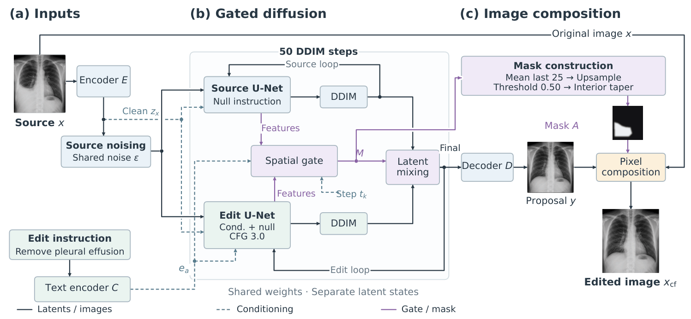

# Spatially Gated Diffusion for Localized Counterfactual Chest Radiograph Editing

[](https://arxiv.org/abs/2610.00805)
[](https://doi.org/10.48550/arXiv.2610.00805)
[](https://www.python.org/)
[](https://pytorch.org/)
[](LICENSE)

Official research repository for:

> **Spatially Gated Diffusion for Localized Counterfactual Chest Radiograph Editing**  
> **Kamran Ullah Afaq, Basit Raza**  
> arXiv:2610.00805, 2026

### 📄 Paper

[**arXiv**](https://arxiv.org/abs/2610.00805) •
[**PDF**](https://arxiv.org/pdf/2610.00805) •
[**DOI**](https://doi.org/10.48550/arXiv.2610.00805)

---

## Overview

This repository contains the research code associated with our work on **localized counterfactual editing of chest radiographs using spatially gated diffusion models**.

The method introduces a **patient-specific spatial gate** that learns where a requested counterfactual intervention is allowed to modify the image. Rather than allowing a diffusion model to alter the complete radiograph, the learned gate restricts editing to a localized region while preserving the remaining anatomical structure from the original image.

The goal is to produce counterfactual radiographs that are:

- spatially localized,
- intervention-effective,
- structurally faithful,
- patient-specific, and
- easier to interpret.

> **Research use only.**  
> This repository is intended for research and reproducibility. It is not a clinical decision-support or diagnostic system. Medical datasets and trained model checkpoints are not distributed in this repository.

---

## Architecture

<p align="center">
  
</p>

<p align="center">
  <i>Overview of the proposed spatially gated diffusion framework for localized counterfactual chest radiograph editing.</i>
</p>

The architecture combines **source-conditioned latent diffusion** with a learned **patient-specific spatial gate**.

During inference, the gate identifies where an intervention may modify the image. Gate predictions are aggregated across the final diffusion steps, transformed into an image-space mask, and used to compose the generated proposal with the original radiograph.

---

## Method

The counterfactual generation pipeline consists of the following stages.

### 1. Source radiograph

The observed chest X-ray provides the patient-specific anatomical structure that should remain preserved wherever editing is unnecessary.

### 2. Counterfactual instruction

A textual or structured intervention specifies the desired counterfactual change.

### 3. Source-conditioned latent diffusion

The input radiograph is encoded into latent space and provided alongside the noisy target latent to the diffusion U-Net.

The diffusion model generates a candidate counterfactual proposal while retaining information from the source radiograph.

### 4. Patient-specific spatial gate

A lightweight convolutional gate predicts a probability map at each denoising step indicating where image modification should occur.

### 5. Gate aggregation

Gate predictions from the final denoising steps are averaged to obtain a stable localization map.

### 6. Mask construction

The aggregated probability map is:

- upsampled from latent resolution to image resolution,
- thresholded at **0.50**,
- refined using an **8-pixel cosine taper**, and
- set to zero outside the predicted intervention region.

### 7. Protected composition

The final counterfactual image is generated using:

```text
x_cf = (1 - A) * x + A * y
```

where:

- `x` is the original radiograph,
- `y` is the generated counterfactual proposal,
- `A` is the spatial edit mask, and
- `x_cf` is the final localized counterfactual.

This formulation allows the model to modify the intervention region while explicitly preserving protected regions from the original radiograph.

---

## Key Contributions

- **Patient-specific spatial localization** for counterfactual chest X-ray editing.
- **Source-conditioned latent diffusion** for structurally consistent image generation.
- A learned **spatial gate** that determines where editing is permitted.
- Explicit **protected-region preservation**.
- Gate-guided image composition rather than unconstrained whole-image generation.
- **Null-intervention training** to encourage identity behavior when no modification is required.
- Localization regularization through area and total-variation objectives.
- Controlled factual/counterfactual generation using matched stochastic conditions.
- High-resolution **1024 × 1024** chest radiograph editing.

---

## Model Configuration

The paper uses an **SDXL Base 1.0** latent diffusion backbone.

| Component | Configuration |
| --- | --- |
| Diffusion backbone | SDXL Base 1.0 |
| Image resolution | 1024 × 1024 |
| VAE latent size | 128 × 128 |
| VAE latent channels | 4 |
| U-Net input | 8 channels |
| Source conditioning | Source latent + noisy target latent |
| VAE | Frozen |
| Adaptation | LoRA + source adapter + spatial gate |
| LoRA rank | 32 |
| LoRA alpha | 32 |
| Spatial gate | 3-layer convolutional network |
| Gate hidden width | 128 |
| Gate output | One sigmoid probability map per step |
| Sampling | DDIM |
| Sampling steps | 50 |
| DDIM η | 0 |
| Guidance scale | 3.0 |

---

## Spatial Gate

The spatial gate operates directly at the latent spatial resolution.

For each diffusion step, the gate predicts:

```text
M_t ∈ [0,1]^(128×128)
```

Multiple gate predictions are aggregated near the end of the denoising trajectory to obtain a stable localization map.

The resulting map is then upsampled to the full **1024 × 1024** image resolution.

At evaluation time:

```text
P >= 0.50
```

defines the active intervention region.

An **8-pixel cosine taper** is applied inside the mask boundary to obtain smoother image composition.

Pixels outside the selected region remain unchanged from the original radiograph.

---

## Training

The model jointly optimizes the diffusion adaptation modules and spatial gate.

### Optimized components

- LoRA parameters
- source-conditioning adapter
- spatial gate

The SDXL VAE remains frozen.

### Training configuration

| Setting | Value |
| --- | --- |
| Optimizer | AdamW |
| Weight decay | 0.01 |
| LoRA / adapter learning rate | 1e-4 |
| Spatial gate learning rate | 2e-4 |
| Batch size | 64 |
| Warm-up | 5,000 steps |
| Training steps | 100,000 |
| LR schedule | Cosine decay |
| Gradient clipping | 1.0 |
| Precision | bfloat16 |
| EMA | 0.9999 |
| Evaluation checkpoint | EMA at step 100,000 |
| Random seeds | 17, 23, 41 |

---

## Training Objectives

The training objective combines generation quality, counterfactual effectiveness, preservation, and localization constraints.

```text
L =
    1.0 L_denoise
  + 0.5 L_target
  + 1.0 L_raw-proposal
  + 1.0 L_final-image
  + 0.5 L_weak-map
  + 1.0 L_null
  + 0.02 L_area
  + 0.005 L_TV
```

The objectives encourage the model to:

- generate the requested counterfactual,
- preserve regions unrelated to the intervention,
- maintain compact spatial edits,
- produce smooth localization maps, and
- reproduce the source image under null interventions.

Approximately **10% of training minibatches** use exact source-to-source null interventions.

---

## Inference

Inference uses deterministic DDIM sampling.

```text
Sampling steps: 50
η: 0
Guidance scale: 3.0
```

The factual and counterfactual trajectories use the same initialization and stochastic conditions to support controlled comparison.

The final gate predictions are aggregated, converted into the intervention mask, and used to compose the generated proposal with the source image.

---

## Repository Structure

```text
.
├── model/          # diffusion model, encoder, U-Net, training and sampling
├── scm/            # structural causal and image-mechanism components
├── benchmarking/   # evaluation and metric utilities
├── scripts/        # training and evaluation entry points
├── assets/         # paper architecture and documentation figures
└── model/cfg/      # experiment configuration files
```

The installed Python namespace is:

```text
counterfactuals
```

---

## Installation

The experiments are designed for **Python 3.9+** with a CUDA-capable PyTorch environment.

```bash
git clone https://github.com/KamranUllahAfaq/Diffusion-counterfactual-explainability.git

cd Diffusion-counterfactual-explainability

python -m venv .venv

source .venv/bin/activate
```

On Windows:

```bash
.venv\Scripts\activate
```

Then install the project:

```bash
python -m pip install --upgrade pip
python -m pip install -e .
```

For GPU execution, install the PyTorch build matching your CUDA environment using the official PyTorch installation instructions:

https://pytorch.org/get-started/locally/

---

## Data

Medical imaging datasets used in this research are not redistributed through this repository.

Researchers are responsible for obtaining the corresponding datasets under their original:

- licenses,
- institutional requirements,
- ethics approvals, and
- data-use agreements.

Dataset locations should be configured locally using the relevant configuration files under:

```text
model/cfg/
```

Do not commit:

- patient datasets,
- model checkpoints,
- generated batches,
- experiment logs, or
- protected medical information

to the repository.

---

## Running Experiments

Review and update the appropriate configuration before launching an experiment.

Example training entry point:

```bash
counterfactual-train --size 64 --expn experiment_name
```

Example evaluation:

```bash
counterfactual-test \
  --output outputs/experiment_name \
  --model-ckpt last_ckpt.pth
```

Environment-specific shell and Slurm scripts should be reviewed before execution because filesystem paths, CUDA settings, partitions, dataset locations, and checkpoint names may differ between systems.

---

## Evaluation

Evaluation considers both **intervention effectiveness** and **preservation/localization quality**.

The repository contains evaluation utilities for measures including:

- counterfactual intervention effectiveness,
- composition consistency,
- reversibility,
- perceptual similarity,
- pixel-space distance,
- protected-region preservation, and
- causal-effect analysis.

For reproducible comparisons, experiments should report:

- dataset split,
- image resolution,
- random seed,
- checkpoint,
- guidance scale,
- denoising steps,
- intervention configuration, and
- spatial-gate configuration.

---

## Paper

### Spatially Gated Diffusion for Localized Counterfactual Chest Radiograph Editing

**Kamran Ullah Afaq, Basit Raza**

📄 **arXiv:**  
https://arxiv.org/abs/2610.00805

📥 **PDF:**  
https://arxiv.org/pdf/2610.00805

🔗 **DOI:**  
https://doi.org/10.48550/arXiv.2610.00805

---

## Citation

If you use this repository or find the paper useful in your research, please cite:

```bibtex
@article{afaq2026spatially,
  title   = {Spatially Gated Diffusion for Localized Counterfactual Chest Radiograph Editing},
  author  = {Afaq, Kamran Ullah and Raza, Basit},
  journal = {arXiv preprint arXiv:2610.00805},
  year    = {2026},
  doi     = {10.48550/arXiv.2610.00805},
  url     = {https://arxiv.org/abs/2610.00805}
}
```

---

## Authors

### Kamran Ullah Afaq

GitHub:  
https://github.com/KamranUllahAfaq

LinkedIn:  
https://www.linkedin.com/in/kamranullahafaq/

### Dr. Basit Raza

Co-author and research collaborator.

---

## Acknowledgment

Special thanks to **Dr. Basit Raza** for his valuable guidance, support, and collaboration throughout this research.

---

## License

This repository is distributed under the **MIT License**.

See [LICENSE](LICENSE) for details.

---

<p align="center">
  <b>Spatially Gated Diffusion for Localized Counterfactual Chest Radiograph Editing</b>
</p>

<p align="center">
  Kamran Ullah Afaq &nbsp;•&nbsp; Basit Raza
</p>

<p align="center">
  <a href="https://arxiv.org/abs/2610.00805">Paper</a>
  &nbsp;•&nbsp;
  <a href="https://doi.org/10.48550/arXiv.2610.00805">DOI</a>
  &nbsp;•&nbsp;
  <a href="https://github.com/KamranUllahAfaq/Diffusion-counterfactual-explainability">Code</a>
</p>
